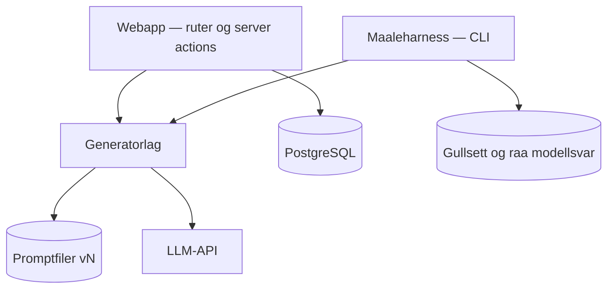
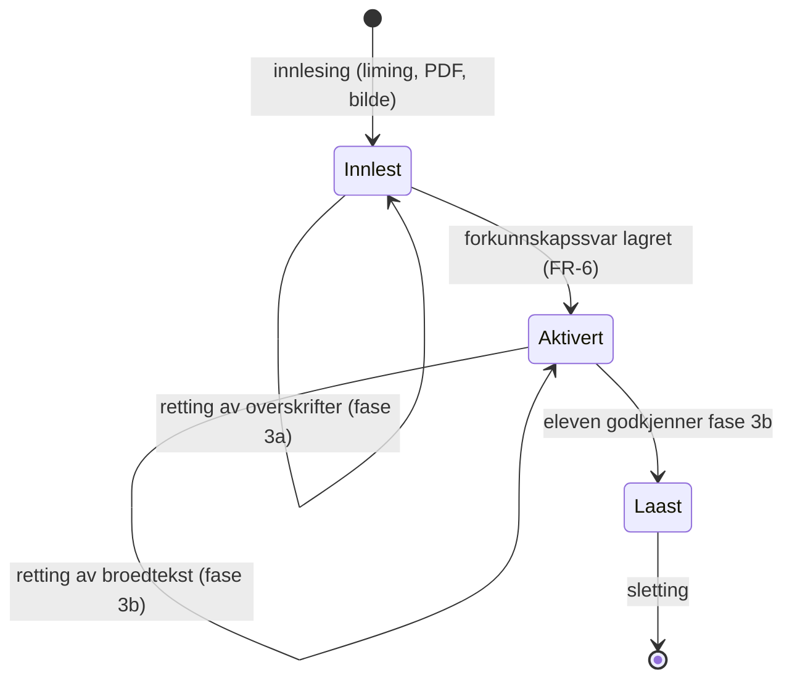
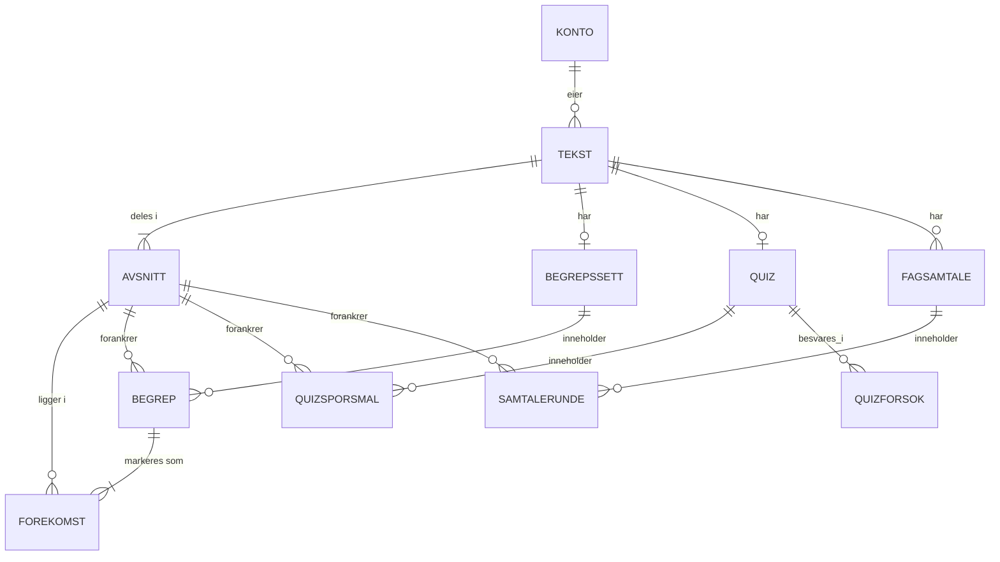

# Arkitekturspine — Lesevenn

## Designparadigme

Lagdelt, med ett lag som er rent: **generatorlaget**. Alt som snakker med en språkmodell bor der, og laget kjenner verken webappen eller databasen. En generator er en ren funksjon fra sin egen erklærte inndatatype pluss promptversjon til validert strukturert utdata — se AD-1 om hva som faktisk er felles. Webappen og måleharnessen er to likeverdige kallere.

Det er dette som gjør at det som måles er det brukeren møter. Uten et rent generatorlag må harnessen enten gå gjennom webappen eller duplisere promptene, og da kan produksjon og måling drive fra hverandre uten at noen merker det.



Pilene som **ikke** finnes er regelen: `Gen` peker aldri på `DB` eller `Web`.

## Invarianter og regler

### AD-1 — All modellinteraksjon gjennom generatorlaget

- **Binds:** alle genererende krav — FR-7, FR-13, FR-19, FR-20, FR-26, FR-28, FR-30, FR-44
- **Prevents:** at promptene finnes i to utgaver, én i webappen og én i harnessen, slik at målingene ikke gjelder det brukeren møter
- **Rule:** ingen modellkall utenfor en generatormodul. Én modul per oppgave. Det som er felles er **kontrakten rundt kallet**, ikke inndatatypen: hver generator erklærer sin egen inndatatype, men alle deler oppslag av promptversjon (AD-14), skjemavalidering av utdata (AD-11), avsnittsreferanser fra mottatt liste der de påstår noe om en Tekst (AD-10), og feilform (konvensjonstabellen). Bildeuttrekk tar bilder, svarvurdering tar spørsmål og elevsvar, oversettelse tar målspråk, minnevers tar Begrepssettet — én felles inndatatype ville vært usann for fire av seks.

### AD-2 — Kildeavsnitt er et avsnittsnummer

- **Binds:** §5 (alt generert innhold har kildeavsnitt), FR-7, FR-14, FR-15, FR-20, FR-21
- **Prevents:** at to enheter tolker «samme avsnitt» ulikt, og at avsnittstesten i FR-21 blir en overlappsregel som selv kan diskuteres
- **Rule:** den låste Teksten deles i avsnitt én gang og lagres som numererte rader. Kildeavsnitt er en referanse til ett slikt avsnitt, aldri et tegnspenn. Tegnposisjoner for inline-markering av Faguttrykk hører til forekomstsettet og eies av AD-13, ikke av forankringen. Hva et avsnitt *er* og hvem som deler teksten, står i AD-12.

### AD-3 — Prompter er versjonerte filer i repoet

- **Binds:** FR-39, FR-40
- **Prevents:** at sammenligning av to promptversjoner krever git-utsjekking, og at prompter havner utenfor versjonskontroll
- **Rule:** `prompts/<oppgave>/vN.md`. Generatoren bruker gjeldende versjon; harnessen kan laste hvilken som helst. Gamle versjoner beholdes på disk. Prompter lagres ikke i databasen.

### AD-4 — Promptversjon stemples på alt

- **Binds:** FR-36, FR-39, FR-40
- **Prevents:** at demo og måling viser ulike tall uten forklaring — en Tekst behandlet med v2 beholder v2-utdata etter at appen er på v3, og det er riktig oppførsel
- **Rule:** hvert lagret generert element noterer **promptversjon og modellidentitet** som lagde det. Hver målekjøring rapporterer begge. Modellidentitet er med fordi §6.4 tillater ulike modeller til ulike oppgaver, og fordi en leverandør kan endre modellen under samme navn — uten modellidentitet i stempelet er to måletall ikke sammenlignbare selv om promptversjonen er lik.

### AD-5 — To kjøringer, delt etter kravets natur

- **Binds:** FR-7, FR-14, FR-20, FR-21, FR-28, FR-31, FR-40
- **Prevents:** at «rapporteres, ingen terskel» presses inn i et testrammeverk som krever bestått eller ikke, og at det oppstår terskler på det som med vilje er beskrivelse
- **Rule:** aksen er **om kontrollen kaller språkmodellen**, ikke om den er maskinsjekkbar. `npm test` er deterministiske sjekker mot lagrede eller konstruerte data — skjemavalidering, delstrengsjekken i FR-7 som funksjon, Jaccard-utregningen som funksjon, stoppordlisten. `npm run maal` er alt som gjør et modellkall, inkludert de maskinelle kravene i FR-20 og de maskinelle testene i FR-21.

Et tidligere utkast delte på «maskinsjekkbar mot statistisk», og det plasserte flere krav feil. FR-20 sine fire krav og FR-21 sin måltest og avsnittstest er maskinsjekkbare med harde terskler, men de kan bare kontrolleres på et generert utdata — altså etter et modellkall. Etter den gamle regelen hørte de i `npm test` og skulle feile bygget, og da får prosjektet nøyaktig det PRD §9.5 advarer mot i sitt eget avsnitt: en port som feiler tilfeldig blir stille droppet etter tredje gang. I tillegg ville hver testkjøring kostet penger.

### AD-6 — Sikkerhetsporten er en utgivelsesport, ikke en byggtest

- **Binds:** FR-21, FR-23, FR-39
- **Prevents:** at en promptversjon som leser en misoppfatning som dekkende tas i bruk — og motsatt, at bygget stopper på noe som ikke er en kodefeil
- **Rule:** består ikke en promptversjon sikkerhetsporten, settes den ikke som gjeldende. Bygget er upåvirket. Porten har egen livssyklus fra koden.

### AD-7 — Harnessen lagrer rå modellsvar

- **Binds:** FR-40, §6.4 (kostnad)
- **Prevents:** at en endring i hvordan en metrikk regnes ut koster nye API-kall
- **Rule:** rå modellsvar lagres som filer i repoet ved siden av de utregnede tallene. Metrikker regnes om fra lagrede svar, ikke fra nye kall.

### AD-8 — Autorisasjon i datatilgangslaget, aldri bare i proxy

- **Binds:** FR-35, FR-36, FR-37, FR-41, §6.2
- **Prevents:** at innhold lekker mellom kontoer gjennom en omgått proxy-sjekk
- **Rule:** hver datatilgangsfunksjon verifiserer at innlogget konto eier raden. Proxy-laget (`proxy.ts` i Next.js 16) er bekvemmelighet, ikke sikkerhetsgrense.

Begrunnelsen er strukturell, og den kan ikke patches bort: **en server action er ikke en egen rute.** Den er en POST til den ruten komponenten brukes i. Flytter du en komponent, eller endrer du proxy-matcheren, kan dekningen forsvinne stille — uten feilmelding, uten at noe slutter å virke. Next.js egen dokumentasjon anbefaler av samme grunn å verifisere autorisasjon inne i hver server-funksjon framfor å stole på proxy alene, og et datatilgangslag med eierskapssjekk er også vernet mot at en bruker gjetter en annens id.

`[HISTORISK: et tidligere utkast begrunnet denne AD-en med CVE-2025-29927, som lot middleware-beskyttelse omgås ved å spoofe x-middleware-subrequest. Den sårbarheten er reell og var kritisk (CVSS 9.1), men den er fikset i 12.3.5, 13.5.9, 14.2.25 og 15.2.3 — altså før Next.js 16 fantes. Å bygge regelen på den ville gjort den lett å avvise for den som slår opp CVE-en og ser at den er lukket. Verdt å nevne i refleksjonsrapporten: en riktig regel med utdatert begrunnelse er sårbar på en annen måte enn en gal regel.]`

### AD-9 — Tekstens livssyklus: tre tilstander, én vei framover

- **Binds:** AD-2, FR-1, FR-2, FR-3, FR-5, FR-6, FR-44
- **Prevents:** at kildeavsnitt-henvisninger peker på tekst som har flyttet seg — og at Aktiveringen kan gjøres om etter at eleven har sett brødteksten
- **Rule:** en Tekst er `Innlest`, `Aktivert` eller `Låst`. Overgangene går bare framover. I `Innlest` er overskriftene redigerbare og brødteksten **ikke tilgjengelig**, verken synlig eller i sidens kildekode. `Aktivert` settes når elevens forkunnskapssvar er lagret, og først da blir brødteksten tilgjengelig for gjennomsyn. `Låst` settes når eleven godkjenner fase 3b, og avsnittslisten er da uforanderlig. Vil eleven endre brødteksten, lager hun en ny Tekst.



Tre tilstander framfor to, fordi prosessen har tre. Et tidligere utkast hadde `Utkast` og `Låst`, og da fantes det ingen regel som gjorde Aktiveringen til et punkt man ikke kan gå tilbake fra. En bygger kunne lovlig lenke 3b → 3a → Aktivering, og da er FR-5 sitt vern tomt: eleven har sett teksten før hun gjetter.

Begrepssett, Quiz, Fagsamtale og Minnevers oppstår først i tilstanden `Låst`.

### AD-10 — Generatorlaget er rent

- **Binds:** AD-1, AD-3, AD-5
- **Prevents:** at harnessen må starte en webapp eller en database for å måle
- **Rule:** generatorlaget importerer verken databaseklient eller rammeverkskode. **Inn: avsnittslisten som verditype** — en liste av `{nummer, tekst}` — pluss promptversjon. Ut: validert strukturert utdata som refererer avsnittsnumre **fra den mottatte listen**. Kalleren lagrer.

Inndataen er avsnittslisten og ikke en tekststreng, og det er en rettelse av et tidligere utkast. Sa regelen «inn: tekst», måtte generatoren nummerere avsnitt på nytt internt, og kalleren måtte avbilde tallet til en rad. Overskrifter gir da systematisk forskyvning, hver forklaring peker på avsnittet ved siden av, og AD-11 fanger det ikke — et kildeavsnittskrav som bare sjekker at tallet er innenfor intervallet godtar en forskyvning på én. Ved å sende listen inn blir validering en medlemskapssjekk mot det settet generatoren faktisk fikk. Renheten er uberørt: en liste av verdier er ikke en databaseklient.

### AD-11 — Skjemavalidering før lagring, ugyldig forkastes

- **Binds:** FR-7, FR-11, FR-20, FR-31, §5
- **Prevents:** at ugyldig utdata blir synlig for eleven eller havner i målegrunnlaget
- **Rule:** alt generert utdata valideres mot sitt skjema før lagring, og brudd håndteres etter **hvilket nivå** de er på:
  - **Elementbrudd** — et enkelt element bryter et verbatim-, kildeavsnitt- eller formkrav. Elementet forkastes. Et Faguttrykk som ikke forekommer ordrett i Teksten finnes ikke, og et kildeavsnittsnummer utenfor den mottatte avsnittslisten (AD-10) er et elementbrudd.
  - **Settbrudd** — settet som helhet bryter en grense, typisk tetthetstaket i FR-7. Settet **kappes** etter viktighetsrangering, lavest først, slik FR-7 foreskriver. Det forkastes ikke.

Skillet er nødvendig fordi et tidligere utkast brukte ordet «forkastes» om begge. Anvendt på et tetthetsbrudd sa det at hele Begrepssettet skulle kastes, mot FR-7 som sier at lavest rangerte uttrykk faller ut først.


### AD-12 — Avsnittsdelingen har én implementasjon, og alle bruker den

- **Binds:** AD-2, AD-9, AD-10, FR-1, FR-2, FR-3, FR-8, FR-14, FR-21, FR-44
- **Prevents:** at samme tekst deles i ulike avsnitt avhengig av hvem som deler den — slik at målingene består mot en avsnittsdeling eleven aldri møter
- **Rule:** det finnes **én ren funksjon** `delIAvsnitt(tekst) → Avsnitt[]` med en nedskrevet delingsregel. Alle tre innlesingsveiene kaller den, og **måleharnessen skal kalle den samme funksjonen** — den lager aldri sin egen deling. Funksjonen er deterministisk: samme inndata gir samme avsnittsliste.

Dette er det hullet som undergravde spinens eget paradigmeargument. AD-2 sa hva et Kildeavsnitt *refererer til*, men aldri hva et Avsnitt *er* eller hvem som lager det. Deler harnessen på linjeskift og appen på tom linje, får samme tekst 48 avsnitt i målingen og 9 i produksjon — og avsnittstesten i FR-21 blir nesten gratis å bestå i den ene og meningsfull i den andre. Påstanden «det som måles er det brukeren møter» var sann for promptene og usann for forankringen.

**Håndheves av** en test som kjører samme tekst gjennom alle tre innlesingsveiene og krever identisk avsnittsliste, og av at harnessen importerer funksjonen framfor å implementere den.

### AD-13 — Forekomstsettet eies, lagres og er det eneste visningen leser

- **Binds:** AD-2, FR-7, FR-9, FR-16, SM-C1
- **Prevents:** at tetthetstaket regnes på ett sett og rendres fra et annet, slik at eleven møter fire ganger så mange markeringer som taket tillater
- **Rule:** Begrepssettet bærer **forekomstsettet** — hver enkelt forekomst av hvert Faguttrykk, som avsnittsnummer pluss tegnposisjon i det avsnittet. Begge tetthetsmålene i FR-7 regnes på forekomstsettet, ikke på antall unike uttrykk. Lesevisningen rendrer **bare** fra forekomstsettet og søker aldri i teksten selv.

Uten dette er «markering» et udefinert ord. Kappingen kunne teller ett uttrykk som én markering og passere taket, mens Lesevisningen markerer hver forekomst fordi FR-9 forbyr den å kutte selv. Et fagtungt avsnitt får da tolv markeringer på åtti ord — langt over taket på tre per hundre — og SM-C1 er brutt av en grense som ble beregnet på det ene settet og virker på det andre.

Merk at dette ikke rører AD-2: Kildeavsnitt er fortsatt et nummer. Tegnposisjonene her hører til forekomstene, ikke til forankringen.

### AD-14 — «Gjeldende promptversjon» står i et manifest, ikke i filsystemet

- **Binds:** AD-3, AD-4, AD-6, FR-39
- **Prevents:** at det å sjekke inn en promptfil *er* forfremmelsen av den — og at webappen og harnessen samtidig har ulik oppfatning av hva som er gjeldende
- **Rule:** `prompts/gjeldende.json` navngir én versjon per oppgave. Generatoren laster **bare** versjoner manifestet navngir, og avviser andre. Harnessen kan kjøre en vilkårlig versjon, men rapporterer alltid hvilken (AD-4). En byggtest krever at hver oppføring i manifestet har et bestått portresultat (AD-6) med matchende fil-hash.

AD-3 gjorde «gjeldende» til en egenskap ved disken, og da forutsatte AD-6 en handling som ikke fantes: å legge v3 i mappa *var* forfremmelsen. Mens v3 lå der kunne webappen kjøre v3 og harnessen v2 uten at promptene var duplisert, og AD-4 gjorde avviket usynlig fordi begge stemplet ærlig.

Byggtesten bryter ikke AD-5, som holder modellkall utenfor testene: den kaller ingen modell. Den sjekker en relasjon mellom to filer i repoet.

### AD-15 — Låsetilstanden håndheves i typesystemet, ikke ved å huske den

- **Binds:** AD-9, AD-11, FR-7, FR-16, FR-36
- **Prevents:** at generert innhold opprettes mot en ulåst Tekst, og at det finnes to Begrepssett på samme Tekst
- **Rule:** det finnes en `LåstTekst`-type som **bare** låsemodulen kan konstruere. Hver funksjon som oppretter generert innhold tar `LåstTekst` som parameter, ikke en id. I tillegg har migrasjonen **unik indeks** på Begrepssett per Tekst og på Quiz per Tekst.

AD-9 dekker skriving *til* en Tekst. Men den som skriver et Begrepssett skriver til Begrepssett-tabellen og aldri til Tekst-tabellen, og var derfor utenfor ordlyden — uten noen pålagt grunn til å lese låsetilstanden. Invarianten hadde da ingen håndhever, bare kallsteder som måtte huske den, og det er nøyaktig formen AD-8 forkaster for autorisasjon.

Den unike indeksen er den andre halvdelen: `TEKST ||--o| BEGREPSSETT` i diagrammet er en tegning, ikke en skranke. To kallsteder som begge gjør «generer hvis mangler» — Lesevisningen og Øvekort — gir to Begrepssett på samme Tekst, og da måler avviksstesten i FR-16 bare hvilken rad spørringen tilfeldigvis fant.

### AD-16 — Binærdata kommer så kort som mulig, og lagres aldri

- **Binds:** FR-2, FR-44, FR-45, §6.2, §6.3
- **Prevents:** at opplastede bilder eller PDF-er blir liggende på disk eller i objektlager, i strid med et juridisk begrunnet forbud — og at en forespørsel sprenger leverandørens grense på 4,5 MB
- **Rule:** **PDF-er parses i nettleseren og sendes aldri til serveren** — bare den uttrukne teksten krysser nettverket. **Bilder krympes i nettleseren** til høyst 2 000 piksler bredde, sendes ett per forespørsel, og hver forespørsel holder seg under 4 MB. På serversiden holdes bildet i minnet gjennom uttrekket og **skrives aldri til disk, objektlager eller database**. Metadata fjernes før bildet sendes. Det som bevares er Råteksten, ikke filen. Alle grenser håndheves i klienten, før noe sendes.

To grunner, og den ene er hard. Den myke: mindre data som forlater elevens maskin er et bedre svar på §6.3 enn en lagringsregel — og for PDF blir svaret at filen aldri forlater maskinen i det hele tatt. Den harde: leverandørens serverfunksjoner tar imot høyst **4,5 MB** i en forespørsel, mens PRD-en tillot 10 MB PDF og 8 MB per bilde. Et tidligere utkast ville truffet `FUNCTION_PAYLOAD_TOO_LARGE` første gang noen lastet opp et mobilbilde i full oppløsning — i drift, ikke lokalt.

Den vanlige løsningen på størrelsesgrensen, direkte opplasting til objektlager med signert URL, er **stengt av denne AD-ens eget forbud**. Klientsiden er utveien som ikke bryter noe.

Følger av dette: PDF-parsing hører i klientkoden, ikke i en serverfunksjon — og det fjerner hele biblioteket fra serverbunten.

### AD-17 — FR-40s tabell har én eier, og manuelle dommer er data

- **Binds:** FR-8, FR-14, FR-21, FR-23, FR-28, FR-40
- **Prevents:** at tersklene ligger spredt over to kjøringer uten at noe setter dem sammen — og at de manuelle vurderingene bare finnes i utviklerens hode eller i et regneark utenfor repoet
- **Rule:** **manuelle dommer lagres som datafiler i repoet**, i en fast form, ved siden av gullsettene: hvilken sak, hvilken dom, hvilken promptversjon og modell, hvilken dato. `npm run maal` er den ene eieren av oppsummeringstabellen FR-40 krever, og den bygger tabellen av tre kilder — resultatene fra `npm test`, sine egne målinger, og de lagrede manuelle dommene. Hver terskel i PRD-en har én rad med målt verdi og bestått eller ikke.

Uten dette er FR-40 sitt krav om «én tabell som viser hver terskel med målt verdi og bestått/ikke bestått» ikke tildelt noen. AD-5 deler kontrollene over to kjøringer, og ingen AD sa hvordan de møtes igjen. De manuelle dommene er den halvparten som er lettest å miste: relevansvurderingen i FR-21, forklaringenes riktighet i FR-8, forankringen i FR-14, tonen i FR-23 og den eksterne vurderingen i FR-28 er alle menneskelige dommer som må kunne kjøres om og vises fram.
## Konsistenskonvensjoner

| Område | Konvensjon |
| --- | --- |
| Domenenavn | Ordlistens norske termer brukes i kode: `Tekst`, `Avsnitt`, `Begrep`, `Begrepssett`, `Quiz`, `Fagsamtale`, `Samtalerunde`, `Svarvurdering`, `Oevekort`, `Minnevers`. Tekniske begreper på engelsk. PRD-ens ordliste *er* vokabularet — en oversettelse mellom norsk krav og engelsk kode skaper et kartleggingslag som drifter |
| Identifikatorer | UUID |
| Dato og tid | ISO 8601 i UTC, både lagret og utvekslet |
| Feilform | Feil fra generatorlaget har én form: typet feil med kode, elevrettet melding på norsk, og anbefalt handling. §5-kravet om at ingen feiltilstand er en blindvei håndheves dermed ett sted, ikke i hver flate |
| Svartilstander (FR-19) | Lukket kodeverk, aldri fritekst: `dekkende`, `delvis`, `misoppfatning`, `uklart`, `utenfor`. Generatorens skjema tillater bare disse fem |
| Oppfølgingsmål (FR-20) | Lukket kodeverk: `nytt_aspekt`, `peker_mot_manglende`, `motsigende_avsnitt`, `ber_om_utdyping`, `deler_opp`. Ett mål per regel i FR-19, i samme rekkefølge |
| Translitterering | Identifikatorer i kode bruker ASCII der verktøy krever det: `oe` for ø, `aa` for å, `ae` for æ. Derfor `Oevekort` og ikke `Ovekort`. Regelen står her fordi et tidligere utkast skrev `Ovekort` uten å si hvorfor, og da gjetter neste bygger |
| Promptfiler | `prompts/<oppgave>/vN.md`, markdown, aldri innebygde strenger |
| Målefiler | Gullsett, rå modellsvar og resultater ligger i repoet under `maaling/`, i versjonskontroll |
| Tilstandsendring | All skriving til en Tekst går gjennom én modul som håndhever AD-9 |

## Stack

| Navn | Versjon | Merknad |
| --- | --- | --- |
| Next.js (App Router) | **16.3.7 eller nyere** | 16.3.6 var nyeste utgitte per 29.09.2026, men Vercel varslet en sikkerhetsutgivelse 30.09.2026 med ni sårbarheter, én kritisk. Pinn 16.3.7+ og les varslene |
| TypeScript | pinnes ved installasjon | |
| PostgreSQL | pinnes ved installasjon | |
| Drizzle ORM | 0.45.x, pinnes ved installasjon | Begrunnet valg, ikke et bransjestandardvalg — se under. **En brytende v1 er i beta.** Ikke oppgrader midt i målekjøringer som skal være sammenlignbare |
| Better Auth | 1.7.x, pinnes ved installasjon | Offisiell guide dekker Next.js 16+ med proxy. `pg` og `drizzle-orm` er peer-avhengigheter |
| pdfjs-dist (i nettleseren) | pinnes ved installasjon | Kjører klientside etter AD-16, så PDF-en aldri sendes til serveren. Gir tekst per side, som PF-1 trenger. `unpdf` sto her da parsing skulle skje på serveren, og er ikke lenger aktuelt |
| LLM-API med strukturert utdata | Anthropic for M0, pinnes ved installasjon | Sammenlignes mot minst én annen leverandør før M1, målt på gullsettet i FR-8. Se Utsatt om vilkårene |

**Hvorfor Drizzle, presist.** Ingen autoritativ kilde utpeker Drizzle som *standardvalget* for Next.js og PostgreSQL — det er en vurdering, ikke et faktum, og et tidligere utkast av denne spinen overdrev det. Begrunnelsen som holder: ingen generate-steg, altså færre bevegelige deler når rammeverket også er nytt; SQL-nær så utvikleren lærer mer SQL, som er et uttalt mål; og `drizzle-kit studio` dekker behovet for å se på data i et grensesnitt under feilsøking. Prisma 7 ble vurdert og er mye lettere etter omskrivingen av spørremotoren; det ville også vært et forsvarlig valg.

**Hvorfor Better Auth, presist.** Det gir full eierskap til brukerdata i egen database, som passer både PostgreSQL-valget og målet om å forstå brukerhåndtering. Merk at to hendelser ofte blandes sammen: Better Auth-teamet overtok *vedlikeholdet* av Auth.js i september 2025, og Vercel kjøpte Better Auth i juli 2026. Det er to separate hendelser, ikke en kodebasesammensmelting.

### Tre fotfeller ved oppsett

Alle tre er stille feil — de gir ikke feilmelding som peker på årsaken.

**Middleware heter proxy.** Next.js 16 har døpt om middleware til `proxy.ts`, som kjører på Node-runtime. Enhver oppskrift skrevet for versjon 15 eller tidligere bruker det gamle navnet.

**Turbopack mot webpack-konfigurasjon.** Next.js 16 kjører Turbopack som standard. De utbredte oppskriftene for `pg` og `drizzle-orm` bruker `webpack`-externals og `serverComponentsExternalPackages`, og kombinasjonen feiler bygget med «This build is using Turbopack, with a webpack config and no turbopack config». Samme klasse felle som proxy-navnet, og mer sannsynlig å treffe først.

**Sidegrensene må bevares ved PDF-uttrekk.** `pdfjs-dist` gir tekst per side, og teksten skal holdes per side gjennom hele uttrekket. Slås sidene sammen til én streng underveis, mister PF-1 forutsetningen sin — terskelen på under 100 tegn *per side* kan ikke regnes ut. Ingenting feiler; deteksjonen slutter bare å virke. Dette var en navngitt felle i `unpdf` (`mergePages: true`), og den gjelder like fullt når man setter sammen sider selv.
## Strukturell grunnform



De tre `forankrer`-relasjonene er AD-2 i datamodellform. `FOREKOMST` er AD-13: hver enkelte markering, med avsnitt og tegnposisjon i det avsnittet — det er dette settet tetthetstaket regnes på og Lesevisningen rendrer fra.

**To skranker som må stå i migrasjonen og ikke bare i diagrammet** (AD-15): unik indeks på `BEGREPSSETT` per `TEKST`, og på `QUIZ` per `TEKST`. Uten dem er `||--o|` en tegning, og to kallsteder som begge gjør «generer hvis mangler» gir to rader.

Øvekortmerking henger på `BEGREP`; Øvekortsettet er ingen egen tabell, fordi FR-16 krever at det *er* Begrepssettet.

```text
app/                  # ruter og server actions (Next.js App Router)
opplasting/           # AD-16 — klientside PDF-parsing og bildekrymping, grensehaandheving
                      #   serverside: mottar krympet bilde, metadatavasking, aldri til disk
generatorer/          # AD-1, AD-10 — ett modul per oppgave, rent lag
  kontrakt.ts         #   felles kontrakt: promptoppslag, skjemavalidering, feilform
prompts/              # AD-3, AD-14 — <oppgave>/vN.md pluss gjeldende.json
tekst/                # innlesing, laasing (AD-9, AD-15)
  avsnittsdeling.ts   #   AD-12 — den ene delingsfunksjonen, importeres ogsaa av maaling/
data/                 # skjema, migrasjoner, datatilgang med eierskapssjekk (AD-8)
maaling/              # AD-5, AD-7, AD-17 — CLI, gullsett, raa svar, manuelle dommer, resultater
```

Mappetreet bærer tre invarianter direkte: `opplasting/` finnes fordi AD-16 trenger et sted, `tekst/avsnittsdeling.ts` er den ene funksjonen AD-12 krever at også `maaling/` importerer, og `generatorer/kontrakt.ts` er det AD-1 mener med felles kontrakt.

Merk at `data/` også holder `raatekst` ved siden av den redigerte teksten, som FR-3 krever. Den er ikke i ER-diagrammet over fordi den er et felt på `TEKST`, ikke en egen entitet.
## Fra krav til arkitektur

| Område | Bor i | Styres av |
| --- | --- | --- |
| Innlesing og gjennomsyn (FR-1..FR-4, FR-44, FR-45) | `opplasting/`, `tekst/`, `app/` | AD-9, AD-11, AD-12, AD-16 |
| Begrepssett og lesevisning (FR-7..FR-12) | `generatorer/`, `app/` | AD-1, AD-2, AD-11, AD-13, AD-15 |
| Quiz (FR-13..FR-15) | `generatorer/`, `app/` | AD-1, AD-2, AD-15 |
| Fagsamtale (FR-18..FR-23) | `generatorer/`, `app/` | AD-1, AD-2, AD-6, AD-14 |
| Morsmål (FR-24..FR-29) | `generatorer/`, `app/` | AD-1, AD-11 |
| Konto og lagring (FR-35..FR-37) | `data/`, `app/` | AD-8 |
| Dokumentasjon og måling (FR-38..FR-43) | `maaling/`, `prompts/` | AD-3, AD-4, AD-5, AD-7, AD-14, AD-17 |

## Driftsomslutning

To miljøer: lokal utvikling og én driftet produksjon. **Ingen staging** — solobygg, og et tredje miljø koster mer enn det gir. Migrasjoner kjøres ved utrulling. Hemmeligheter som miljøvariabler, aldri i repoet. Utrulling fra Git.

## Utsatt

| Utsatt | Hvorfor det kan vente |
| --- | --- |
| Valg av konkret skyleverandør | **Må avklares før M0, ikke etter.** Et tidligere utkast sa at det ikke påvirker hvordan noe bygges, og det er galt — valget avgjør om PDF-uttrekk med native avhengigheter kan kjøre, om opplastinger kan holdes i minnet (AD-16), og om lange modellkall rekker innenfor tidsavbruddet. Utsatt bare i den forstand at biblioteksvalgene over ikke henger på det |
| Oppsett og vilkår hos LLM-leverandøren | **Leverandør er valgt for M0 — Anthropic** — med sammenligning mot minst én annen før M1, målt på gullsettet i FR-8. Det som gjenstår er kravene i PRD §6.2, altså at inndata ikke brukes til trening, at behandlingsstedet er kjent, og at vilkårene er lest og datert. Må dokumenteres før M0 |
| Overvåking og logging utover feilsporing | Én bruker, ett miljø. Kan ikke gjøre to enheter uforenlige |
| Hastighetsbegrensning | Ingen åpen registrering i v1, kostnadstakene i §6.4 er den reelle grensen |
| Sikkerhetskopiering | Ingen produksjonsdata med verdi i v1 (§2.2) |
| i18n-rammeverk for grensesnittet | Grensesnittet er på norsk i v1. Morsmålsstøtten er innhold, ikke lokalisering — FR-25 krever at norsk alltid vises samtidig |
| Mapper (FR-32..FR-34, trukket tilbake) | Ute av v1, se PRD §4.9. Kommer den tilbake, trenger samlet fagsamtale et eget måleopplegg |
